# Scraper Pipeline — Sequence Diagram

```mermaid
sequenceDiagram
    participant User
    participant Code as index.ts (Orchestrator)
    participant Crawler as crawler.ts (Playwright)
    participant Agent as Agent SDK (query)
    participant API as Anthropic API (messages.create)
    participant Disk as output/

    User->>Code: bun run index.ts https://example.com

    %% ──────────────────────────────────────
    %% PHASE 1: Crawl
    %% ──────────────────────────────────────
    rect rgb(230, 255, 230)
        Note over Code,Disk: Phase 1 — Crawl (Programmatic, 0 tokens, 0 cost)
        Code->>Crawler: crawlSite(url, {concurrency: 50})
        loop BFS — follow all same-domain links until exhausted
            Crawler->>Crawler: Fetch page (Playwright, 50 concurrent)
            Crawler->>Crawler: Preprocess HTML (strip scripts, styles, attributes)
            Crawler-->>Disk: Save to output/pages/*.html
            Crawler->>Crawler: Extract <a href> links → add new ones to queue
        end
        Crawler-->>Code: All pages on disk

        Note over Code: TUI Output:<br/>Pages crawled: 273<br/>Time: 4m 32s<br/>Tokens: 0<br/>Saved to: output/pages/
    end

    %% ──────────────────────────────────────
    %% PHASE 2: Structure Analysis
    %% ──────────────────────────────────────
    rect rgb(255, 245, 230)
        Note over Code,Agent: Phase 2 — Structure Analysis (Agent, structured output)
        Code->>Code: List all crawled URLs from output/pages/
        Code->>Agent: query(prompt + URL list, outputFormat: structure schema)
        Note over Agent: Step 1: Receives all 273 URLs as text (cheap, no HTML)
        Note over Agent: Step 2: Group URLs by path pattern (from URLs alone)<br/>  /doctor/* → 30 URLs<br/>  /zh/* → 80 URLs<br/>  /2024/* → 20 URLs<br/>  /category/* → 10 URLs<br/>  unique paths → 15 URLs

        loop Step 3: For each group, read 1-2 pages to verify content type
            Agent->>Disk: Read sample page from this group
            Disk-->>Agent: HTML content
            Note over Agent: Real content → keep group<br/>Just links/listing → skip group
        end

        loop Step 4: For ambiguous URLs that don't fit any group, read to decide
            Agent->>Disk: Read ambiguous page
            Disk-->>Agent: HTML content
            Note over Agent: Has unique content? → keep<br/>Just transition page? → skip
        end

        Note over Agent: Final result:<br/>  /doctor/* → doctor_profile (keep, 30 pages)<br/>  /our-services/* → service_detail (keep, 4 pages)<br/>  / → landing (keep, 1 page)<br/>  /2024/* → skip (date archives)<br/>  /zh/* → skip (non-primary language)<br/>  /category/* → skip (listing pages)

        Agent->>Disk: Write output/structure.json (kept pages by type)
        Agent->>Disk: Write output/filtered.json (skipped pages + reasons)
        Agent-->>Code: done

        Note over Code: TUI Output:<br/>Total crawled: 273<br/>Pages kept: 80 (12 types)<br/>Pages filtered: 193<br/>  - Date archives: 24<br/>  - Pagination: 8<br/>  - Category filters: 15<br/>  - Non-primary language: 146<br/>Tokens: 85k (in) / 4k (out)<br/>Turns: 12<br/>Time: 45s
    end

    %% ──────────────────────────────────────
    %% PHASE 3: Schema Generation
    %% ──────────────────────────────────────
    rect rgb(245, 230, 255)
        Note over Code,Agent: Phase 3 — Schema Generation (Agent, dynamic output)
        Code->>Agent: query("Generate JSON Schema per page type")
        Agent->>Disk: Read output/structure.json
        Disk-->>Agent: 12 page types with sample_urls

        loop For each page type
            alt Group ≤30 pages
                Agent->>Disk: Read ALL pages of this type
                Disk-->>Agent: HTML content
            else Group >30 pages
                Agent->>Disk: Read samples until no new sections found
                Disk-->>Agent: HTML content
            end
            Note over Agent: Design union JSON Schema (draft-07)<br/>Merges ALL section variations into one template<br/>Captures: text, images, links, forms, CTAs
        end

        Agent->>Disk: Write output/schema.json
        Agent-->>Code: done

        Note over Code: TUI Output:<br/>Page types: 12<br/>Schemas generated: 12<br/>Tokens: 120k (in) / 15k (out)<br/>Turns: 18<br/>Time: 1m 20s
    end

    %% ──────────────────────────────────────
    %% PHASE 4: Content Extraction
    %% ──────────────────────────────────────
    rect rgb(255, 230, 230)
        Note over Code,API: Phase 4 — Content Extraction (Programmatic, dynamic structured output)
        Code->>Disk: Read output/structure.json
        Disk-->>Code: Page types + URL-to-type mapping
        Code->>Disk: Read output/schema.json
        Disk-->>Code: JSON Schema per page type

        par 5 pages in parallel, retry x3
            loop For EACH kept page
                Code->>Disk: Read page HTML from output/pages/
                Disk-->>Code: HTML content
                Code->>Code: Look up pagetype for this URL
                Code->>Code: Get schema for this pagetype from schema.json

                Code->>API: messages.create({<br/>  messages: [{role: "user", content: HTML}],<br/>  outputFormat: {<br/>    type: "json_schema",<br/>    schema: <schema for this pagetype><br/>  }<br/>})
                Note over API: Schema enforces correct JSON structure<br/>Different schema per page type (dynamic)
                API-->>Code: Validated JSON content

                Code->>Code: Add to results[pagetype].entries
            end
        end

        Code->>Disk: Write output/content.json

        Note over Code: TUI Output:<br/>Pages to extract: 80<br/>Extracted: 80/80<br/>Failed: 0<br/>Tokens: 2.4M (in) / 800k (out)<br/>API calls: 80<br/>Time: 12m 15s
    end

    Code-->>User: Done! Check output/
```



## 4-Phase Overview

| Phase | Type | LLM? | Structured Output? | Input | Output |
|-------|------|------|--------------------|-------|--------|
| 1. Crawl | Programmatic | No | N/A | Website URL | output/pages/*.html |
| 2. Structure | Agent | Yes | Yes (fixed schema) | Crawled URLs + HTML on disk | structure.json + filtered.json |
| 3. Schema | Agent | Yes | No (agent generates schemas) | structure.json + HTML on disk | schema.json |
| 4. Extract | Programmatic | Yes (direct API) | Yes (dynamic, from schema.json) | structure.json + schema.json + HTML on disk | content.json |

## Structured Output Usage

```
Phase 2: outputFormat = fixed JSON Schema for structure.json format
         → guarantees { site_url, page_types: [{ name, url_pattern, urls, ... }] }

Phase 3: no structured output
         → agent generates JSON Schemas freely (dynamic, site-dependent)

Phase 4: outputFormat = schema from schema.json, per page type
         → doctor pages use doctor_profile schema
         → service pages use service_detail schema
         → guarantees content matches the schema exactly
```

## Page Filtering (Phase 2)

Two signals combined — URL pattern hints + HTML content proof:

```
Signal 1: URL Pattern (hint)          Signal 2: HTML Content (proof)
────────────────────────────          ──────────────────────────────
/doctor/dr-lim/  → likely real       Has bio, photo, qualifications → KEEP ✓
/about-us/       → likely real       Has paragraphs, images         → KEEP ✓
/2024/03/29/     → suspicious        Just a list of post links      → SKIP ✗
/2024/03/29/     → suspicious        Has a full article             → KEEP ✓ (URL alone isn't enough!)
/category/articles/ → suspicious     Just card links to articles    → SKIP ✗
/zh/about-us/    → non-primary lang  Chinese translation            → SKIP ✗
```

**The rule: if a page has unique content worth rebuilding, keep it. If it's just a transition page that lists/filters/paginates content from other pages, skip it. Always verify by reading the HTML when the URL alone is ambiguous.**

## Output Files

| File | Purpose | Passed to rebuilder? |
|------|---------|---------------------|
| output/pages/*.html | Raw crawled HTML on disk | No |
| output/structure.json | Page types + URL grouping | Yes |
| output/filtered.json | Skipped pages + reasons | No (TUI/debug only) |
| output/schema.json | JSON Schema per page type | Yes |
| output/content.json | Extracted content grouped by type | Yes |

## Resume Points

Each phase reads/writes independent files. Run any phase standalone:

```bash
bun run index.ts https://example.com              # all 4 phases
bun run index.ts https://example.com --phase 2    # just structure (reads output/pages/)
bun run index.ts https://example.com --phase 3    # just schema (reads structure.json)
bun run index.ts https://example.com --phase 4    # just extract (reads structure + schema)
```

```
output/pages/ populated? → skip Phase 1
structure.json exists?   → skip Phase 2
schema.json exists?      → skip Phase 3
content.json exists?     → skip Phase 4
```
